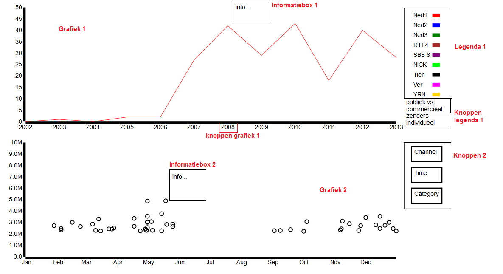
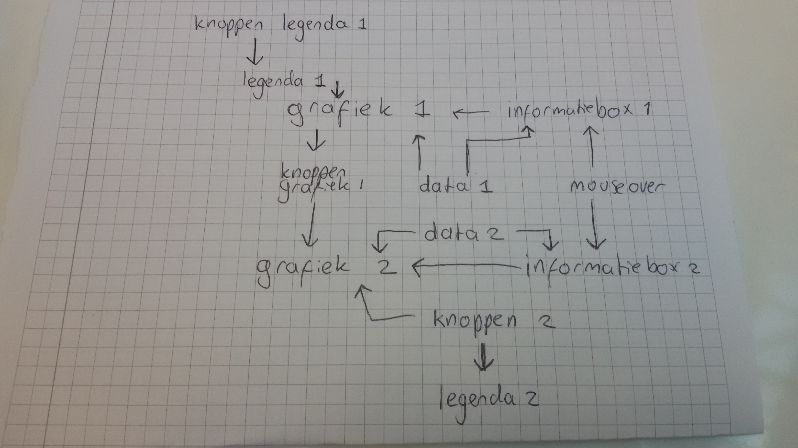

# Design Document 
## Datavisualisatie 50 best bekeken tv-momenten door de jaren heen
Jenny Hasenack   
10367519    
08-01-2016
Programmeerproject   
Datavisualisatie   

## User Interface
De totale visualisatie ziet er als volgt uit. Als de gebruiker op de webpagina komt, is er één grafiek te zien. Dit is de grafiek van het aantal uitzendingen in de top 50 door de jaren heen. 
Bij binnenkomst op de webpagina is standaard de grafiek met de lijn van iedere zender te zien. Rechts naast de grafiek is een legenda. Hier staat een lijst van alle zenders die in ieder geval één keer met een uitzending in de top 50 zijn gekomen. In de legenda wordt verklaard welke kleur lijn bij welke zender hoort.
De gebruiker kan op de zenders in de legenda klikken. De lijn wordt dan weggehaald als hij is weergegeven, of juist getekend als hij nog niet zichtbaar was.
Onder de legenda zijn twee knoppen zichtbaar: "Publiek vs. commercieel" en "Zenders individueel". Standaard is "Zenders individueel" aangeklikt. Hiermee wordt er voor elke zender een aparte lijn getekend.
Als de gebruiker op "Publiek vs. commercieel" klikt, verdwijnen alle lijnen en verschijnen twee nieuwe lijnen. Deze bevatten respectievelijk de data van alle publieke omroepen (Ned1, Ned2, Ned3) opgeteld en die van alle commerciele omroepen (alle overige zenders). De legenda verandert dan; in plaats van een lijst met alle zenders worden hier nu alleen de twee kleuren van de publieke en commerciële lijnen verklaard.

Als de gebruiker met de cursor over de grafiek beweegt, verschijnt er (als de muis een bepaalde tijd stilstaat) een informatiebox met daarin de informatie van het jaar waar de cursor op dat moment het dichtst bij is. In de informatiebox wordt het jaar en het aantal uitzendingen in de top 50 per weergegeven lijn gegeven. Op het moment dat de gebruiker zijn cursor weer beweegt verdwijnt de informatiebox.

Onder de grafiek bevinden zich knoppen met de beschikbare jaartallen. Als de gebruiker op een van de knoppen klikt, verschijnt onder de lijngrafiek een andere grafiek. Deze grafiek geeft de top 50 best bekeken tv-momenten van het desbetreffende jaar weer. Alle datapunten worden gerepresenteerd als een cirkel. Als de gebruiker met zijn cursor in de cirkel komt, verschijnt (na een korte timeout) een informatebox. 
Hierin staat de volgende informatie weergegeven: titel, datum, tijd, zender, aantal kijkers. Als de gebruiker de cursor weer beweegt verdwijnt deze informatiebox. 
Naast de tweede grafiek staan een aantal knoppen: Channel, Time en Category. Op het moment dat de gebruiker op één van deze knoppen klikt, worden de cirkels ingekleurd voor hun waarde bij de desbetreffende knop. Voor Channel en Category zijn dat losse kleuren, voor Time zijn het kleuren uit een kleurenschaal. Er verschijnt tevens een legenda die de gebruikte kleuren verklaart. Als de gebruiker nogmaals op dezelfde knop klikt, verdwijnen de kleuren weer.

## MVP
De MVP is in dit geval een grafiek met de lijnen van alle zenders (x-as: jaartal, y-as: aantal uitzendingen in top 50) (grafiek 1) met zijn legenda, waarbij op ieder jaartal geklikt kan worden om de uitzendingen in de top 50 van dat jaar op een grafiek (x-as: datum, y-as: aantal kijkers) te zien. Ook is er bij de tweede grafiek een mouseoverfunctie nodig die de informatie van de aflevering geeft in een infobox als de cursor op dat datapunt komt. 
De andere onderdelen van de visualisatie voegen ook zeker wat toe, maar zijn niet noodzakelijk om het doel van de visualisatie te bereiken: inzicht geven in het verloop van de top 50 door de jaren heen en de samenstelling per jaar. Deze andere onderdelen vergroten het gebruikersgemak en zorgen zo dat er makkelijker conclusies kunnen worden getrokken. Het gaat dus om de mouseoverfunctie in grafiek 1, de mogelijkheid lijnen toe te voegen of te verwijderen, de mogelijkhied te kiezen tussen commercieel vs. publiek in grafiek 1, de mogelijkheid kleur toe te voegen in grafiek 2 en de de legenda die bij dat kleurgebruik hoort. Deze onderdelen behoren niet tot de MVP.

## Code
Hieronder zullen de verschillende onderdelen van de code worden beschreven, en de manier waarop ze samenwerken. Alle onderdelen met een '1' horen bij de grafiek die de data van de zenders over de jaren heen weergeeft en alle onderdelen met een '2' horen bij de grafiek die de data van een individueel jaar weergeeft.

Het ontwerp is te zien in de volgende afbeelding:

Bij de zichtbare onderdelen van de visualisatie is geschreven hoe ze worden genoemd in onderstaande uitleg. Hoe de onderdelen met elkaar samenwerken is verbeeld in de volgende afbeelding en hieronder toegelicht:

#### Knoppen legenda 1
Deze knoppen staan boven de legenda van grafiek 1. De gebruiker kan hiermee bepalen of de data moet worden verdeeld in 'zenders individueel' of 'publieke vs. commerciele zenders'. Op het moment dat er op een van deze knoppen wordt geklikt, wordt er een functie opgeroepen die de huidige legenda 1 verwijdert en een nieuwe tekent op basis van de keuze van de gebruiker. Ook worden dan alle lijnen verwijderd.

#### Legenda 1
Deze legenda wordt getekend door een functie die wordt aangeroepen door 'Knoppen legenda 1'. Deze legenda bevat een aantal knoppen die bepalen welke lijnen er worden getekend in grafiek 1. Op het moment dat er een knop wordt aangeklikt, wordt er een functie aangeroepen. Deze functie controleert of deze lijn al bestaat. Is dat het geval, dan wordt hij verwijderd. Anders wordt hij getekend. 

#### Grafiek 1 
Deze grafiek wordt getekend en heeft toegang tot alle data 1 (dus de data van alle zenders over de jaren heen). Op basis van deze data worden er onder de grafiek ook een aantal knoppen getekend, een voor elk jaar.

#### Knoppen grafiek 1
Deze knoppen roepen wanneer ze worden aangeklikt een functie op die grafiek 2 verwijdert als deze al getekend was en opnieuw grafiek 2 tekent met de informatie van dat jaar. 

#### Mouseover
De mouseoverfunctie komt in deze datavisualisatie twee keer voor, een keer voor grafiek 1 en een keer voor grafiek 2. Op het moment dat de muis over respectievelijk de svg van grafiek 1 en grafiek 2 beweegt, wordt een functie aangeroepen die respectievelijk informatiebox 1 en 2 tekent. Om deze informatiebox te tekenen is respectievelijk data 1 en data 2 nodig. 

#### Grafiek 2 
Wordt getekend met een functie die wordt getekend als een van de knoppen van grafiek 1 wordt aangeklikt. Hiervoor is data 2 nodig. Wordt ook beïnvloed door de knoppen van grafiek 2.

#### Knoppen grafiek 2
Als een van deze knoppen (Zender, Tijd, Categorie) wordt aangeklikt, wordt een functie aangeroepen die de kleuren van grafiek 2 aanpast, afhankelijk van de waarde van het datapunt. Hiervoor is ook data 2 nodig. Ook wordt een functie aangeroepen die een legenda tekent om de gebruikte kleuren te verklaren. 

#### Legenda 2 
Wordt getekend op het moment dat een van de knoppen van grafiek 2 wordt aangeklikt. Om deze te tekenen is ook data 2 nodig, om het aantal verschillende kleuren of de range van de data te bepalen.

## Data
De data is gescraped van www.kijkonderzoek.nl. Hiermee is voor elk jaar (2002 tot 2013) een csv-bestand gemaakt met daar in de 50 meest bekeken tv-momenten. Van elk moment is de titel, datum, tijd, aantal kijkers en zender opgeslagen. Uit deze 11 csv-bestanden is daarna voor elke zender een csv-bestand gemaakt met het aantal uitzendingen in de top 50 per jaar. Vanuit deze data zijn weer twee nieuwe csv-bestanden gemaakt, een met alle data van de publieke omroep bij elkaar opgeteld en een met alle data van de commerciële omroepen bij elkaar opgeteld.
