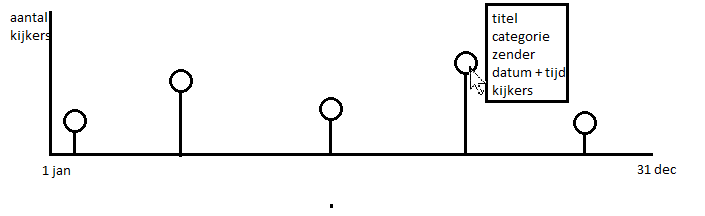
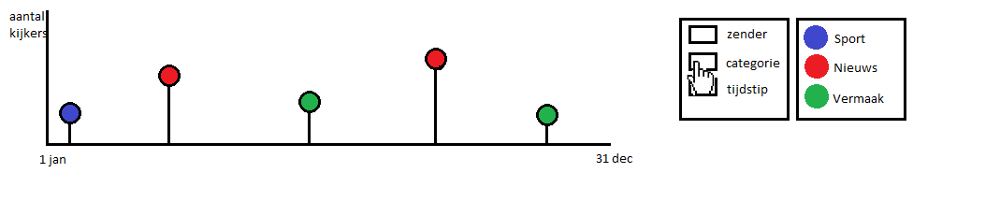

# Titel
Jenny Hasenack 
10367519
04-01-2016
Datavisualisatie 
Jenny Hasenack 
10367519 

## Samenvatting

## Probleem
Inzicht krijgen in meest bekeken programma's van een jaar. Wat voor programma's waren dit, hoe laat kwamen ze, van welke zender zijn ze. 
Ik wil inzicht geven in welke programma's het meest bekeken zijn en wanneer deze zijn uitgezonden. 

## Schets 
 
    De visualisatie is in de vorm van een grafiek. Op de horizontale as wordt de tijd weergegeven en op de verticale as het absoluut aantal kijkers. De 50 best bekeken programma's worden in deze grafiek geplaatst en zijn zichbaar als cirkels. Als de gebruiker met de muis op een van de cirkels staat, verschijnt er informatie over het desbetreffende programma, bijvoorbeeld de titel, de categorie (sport, entertainment, nieuws etcetera), de zender, de datum en tijd van uitzending en het aantal kijkers. 

    Ook staan er naast de grafiek een aantal koppen waar de gebruiker op kan klikken. Deze knoppen hebben de titels 'categorie', 'zender' en 'tijd'. Als de gebruiker op één van deze knoppen klikt zal de grafiek de datapunten kleuren. Bij het klikken op 'categorie' worden bijvoorbeeld de programma's die onder de categorie 'sport' vallen groen gekleurd en de nieuwsprogramma's rood (etc.). Er verschijnt dan ook een legenda om de gebruikte kleuren te verklaren. 

