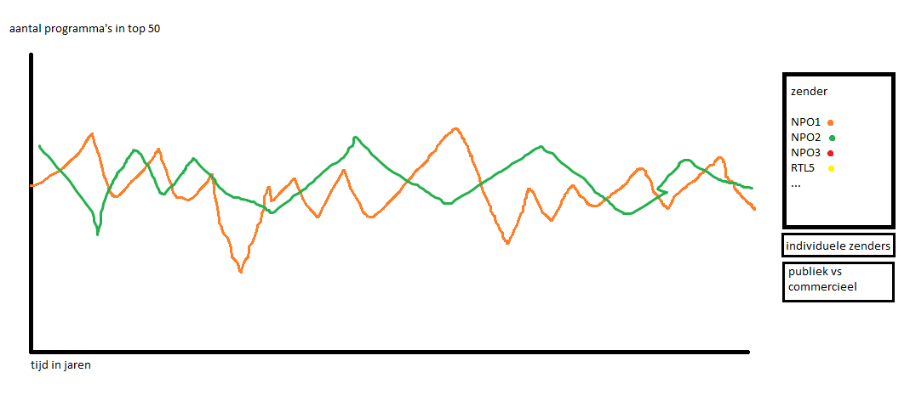
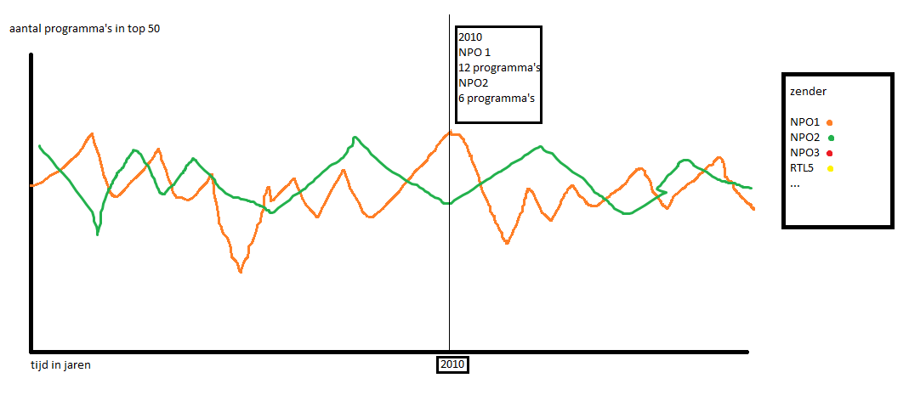

# Interactieve datavisualisatie voor de 50 best bekeken tv-programma's van het jaar 
Jenny Hasenack 
10367519
04-01-2016
Datavisualisatie 
Jenny Hasenack 
10367519 

## Samenvatting

## Probleem
Inzicht krijgen in meest bekeken programma's van een jaar. Wat voor programma's waren dit, hoe laat kwamen ze, van welke zender zijn ze. 
Ik wil inzicht geven in welke programma's het meest bekeken zijn en wanneer deze zijn uitgezonden. 

## Schets 

De visualisatie bestaat uit twee delen. Een deel dat de verandering van de samenstelling van de top 50 meest bekeken programma's weergeeft over de jaren heen, en een deel dat per jaar weergeeft welke programma's er in de top 50 stonden. 

 

Het eerste deel is in de vorm van een lijngrafiek. Deze geeft het aantal programma's in de top 50 per jaar weer van één zender. De gebruiker kan zelf op de legenda klikken om zenders toe te voegen of te verwijderen uit de grafiek. Onder de legenda kan de gebruiker kiezen om de grafieken van individuele zenders weer te geven, of om publieke zenders met commerciële te vergelijken. Er worden in het laatste geval twee lijnen getekend. 

Er wordt een legenda getekend bij de x-coördinaat van de muis met informatie over de samenstelling van de top 50 in dat jaar. Ook wordt er een verticale lijn getekend zodat de gebruiker de lijnen goed kan vergelijken. Op de x-as van de grafiek kan op het jaartal worden geklikt. Er verschijnt dan onder de grafiek onderstaande tweede grafiek met informate over dat jaar:

Op de horizontale as wordt de tijd weergegeven en op de verticale as het absoluut aantal kijkers. De 50 best bekeken programma's worden in deze grafiek geplaatst en zijn zichbaar als cirkels. Als de gebruiker met de muis op een van de cirkels staat, verschijnt er informatie over het desbetreffende programma, bijvoorbeeld de titel, de categorie (sport, entertainment, nieuws etcetera), de zender, de datum en tijd van uitzending en het aantal kijkers. 

Ook staan er naast de grafiek een aantal koppen waar de gebruiker op kan klikken. Deze knoppen hebben de titels 'categorie', 'zender' en 'tijd'. Als de gebruiker op één van deze knoppen klikt zal de grafiek de datapunten kleuren. Bij het klikken op 'categorie' worden bijvoorbeeld de programma's die onder de categorie 'sport' vallen groen gekleurd en de nieuwsprogramma's rood (etc.). Er verschijnt dan ook een legenda om de gebruikte kleuren te verklaren. Zender en categorie zijn discrete verdelingen. Deze zijn eenvoudig weer te geven door een kleur toe te kennen aan iedere zender of categorie. Deze kleuren kunnen redelijk willekeurig worden gekozen. Tijd is een continue verdeling. Voor de duidelijkheid zal hier kunstmatig een discrete verdeling van worden gemaakt, door bijvoorbeeld per uur een kleur te kiezen. Hiervoor zullen kleuren uit een kleurenschaal worden gekozen, bijvoorbeeld een kleur die steeds verzadigder wordt naarmate het tijdstip later wordt. Hierdoor kunnen de tijdstippen beter worden vergeleken. 

## Verkrijgen van data
De benodigde data kan verkregen worden van de website www.kijkonderzoek.nl. Er zal in Python een scraper worden gemaakt om de benodigde data van de volgende webpagina te halen: https://kijkonderzoek.nl/component/com_kijkcijfers/Itemid,133/file,j1-0-1-p. De data zal worden opgeslagen in de vorm van een csv-bestand. Het bestand is per jaar een lijst van lijsten met per programma de titel, datum, zender, etcetera. Deze lijsten zullen worden geanalyseerd om per zender te kijken wat het aandeel in de top 50 is voor ieder jaar.

## Onderdelen visualisatie 
Deze visualisatie heeft verschillende onderdelen. Er zijn twee grafieken: een die de verandering over de jaren heen weergeeft en een met informatie per jaar. 

### Grafiek over de jaren heen

#### De grafiek

### Grafiek per jaar

#### De grafiek
De oorspronkelijke grafiek is de basis van dit deel van de visualisatie. Deze is nog niet interactief. Op de horizontale as staat de tijd in maanden, op de verticale as het absoluut aantal kijkers in miljoenen. De programma's worden op deze grafiek weergegeven in de vorm van kleine cirkels (dit zijn html-objecten). Hiervoor worden de kopjes 'datum' en 'absoluut aantal kijkers' uit het csv-bestand gebruikt. 

#### Mouseover 
De mouseover-functie houdt bij waar de cursor van de gebruiker zich bevindt. Als dit binnen een bepaalde afstand van het midden van een van de cirkels is, wordt er een functie aangeroepen die een vakje tekent waar de informatie over dat datapunt in wordt weergegeven. Dat gebeurt met de functie Informatie. 

#### Informatie 
Deze functie tekent een vakje met informatie over het datapunt op het moment dat de cursor van de gebruiker op dat datapunt staat Hij wordt dus aangeroepen door de functie Mouseover. Het vakje wordt rechtsboven de cursor getekend. De informatie voor in het vakje wordt weer uit het csv-bestand gehaald. Deze functie heeft dus alle informatie uit het csv-bestand nodig en de muiscoördinaten van de Mouseover-functie. 

#### Knoppen 
De knoppen kunnen door de gebruiker worden aangeklikt om meer inzicht te krijgen in de variatie van de data op verschillende gebieden. Er zijn drie knoppen: zender, categorie en tijd. Op het moment dat een van deze knoppen wordt ingedrukt, worden twee functies aangeroepen: een om de cirkels opnieuw te kleuren en een om een legenda te tekenen. 

#### Cirkels kleuren
Met deze functie worden de cirkels opnieuw gekleurd. De kleur is afhankelijk van de informatie op dat punt en wordt bepaald door de Legenda-functie. Deze functie heeft dus informatie van deze functie nodig en toegang tot de html-elementen die in de Grafiek-functie zijn getekend. 

### Legenda 
Met deze functie wordt er onder het vakje met de knoppen een legenda getekend op het moment dat een van de knoppen wordt ingedrukt. De legenda kan getekend worden voor continue data of voor discrete data. Als de data continu is (dus bij tijd) wordt het eerst discreet gemaakt, door bijvoorbeeld per uur een aparte kleur te maken. Er moet dan worden bepaald in welk uur elk programma valt. De kleuren die worden gebruikt zijn van dezelfde tint en variëren alleen in verzadiging. Voor discrete data kunnen kleuren willekeurig worden gekozen uit een kleurenset (zo lang de kleuren maar genoeg en evenveel van elkaar verschillen). Deze functie heeft dus de data uit het csv-bestand nodig en geeft de gebruikte kleuren door aan de functie Cirkels kleuren. 

# Mogelijke problemen

## Verkrijgen van data
De data is niet rechtstreeks beschikbaar als csv maar moet eerst gescraped worden van een webpagina. Een mogelijk probleem is dat het schrijven van de scraper lang duurt, waardoor er minder tijd is voor de daadwerkelijke visualisatie. Een mogelijke oplossing is het deels hergebruiken van een scraper die gemaakt is voor het vak Data Processing. In het uiterste geval kan de csv ook met de hand worden gemaakt, aangezien het maar om 50 datapunten gaat. 

## 
