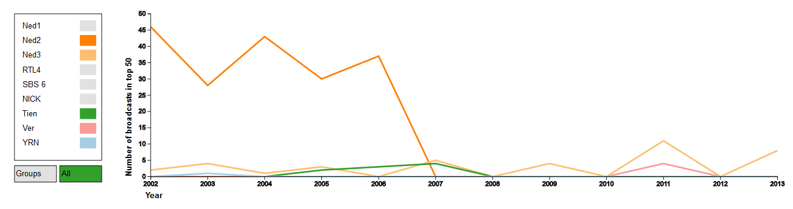
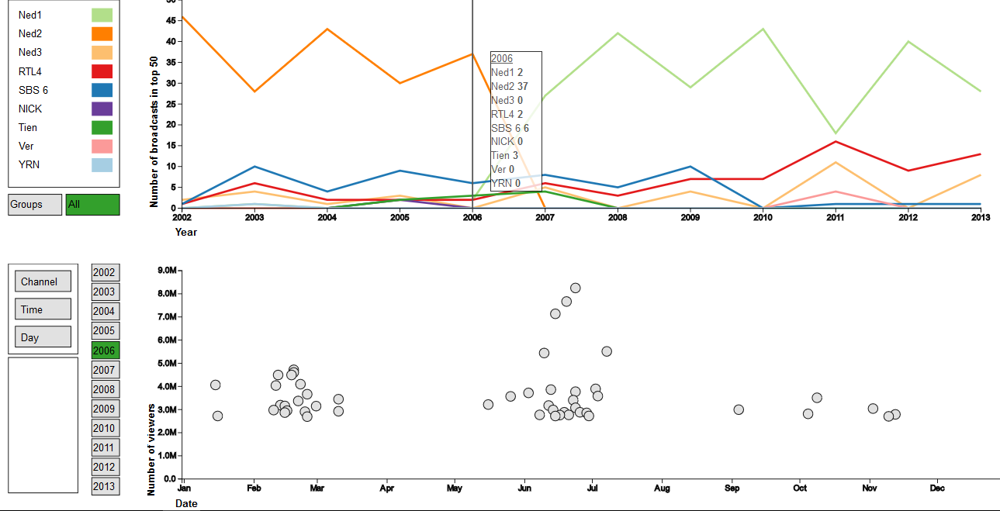
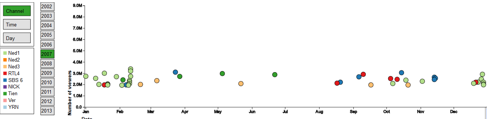

# Projectverslag
## Datavisualisatie 50 best bekeken tv-momenten door de jaren heen
Jenny Hasenack   
10367519    
28-01-2016
Programmeerproject   
Datavisualisatie   

##Beschrijving 

De totale visualisatie ziet er als volgt uit. Als de gebruiker op de webpagina komt, is er één grafiek te zien. Dit is de grafiek van het aantal uitzendingen in de top 50 door de jaren heen (een lijngrafiek). 
Bij binnenkomst op de webpagina is standaard de grafiek met de lijn van iedere zender te zien. Links naast de grafiek is een legenda. Hier staat een lijst van alle zenders die in ieder geval één keer met een uitzending in de top 50 zijn gekomen. In de legenda wordt verklaard welke kleur lijn bij welke zender hoort.
De gebruiker kan op de kleuren van de zenders in de legenda klikken. De lijn wordt dan verborgen als hij is weergegeven, of juist weergegeven als hij nog niet zichtbaar was.

Onder de legenda zijn twee knoppen zichtbaar: "All" en "Groups". Standaard is  "All" aangeklikt. Hiermee wordt er voor elke zender een aparte lijn getekend.
Als de gebruiker op "Groups" klikt, verdwijnen alle lijnen en verschijnen twee nieuwe lijnen. Deze bevatten respectievelijk de data van alle publieke omroepen (Ned1, Ned2, Ned3) opgeteld en die van alle commerciele omroepen (alle overige zenders). De legenda verandert dan; in plaats van een lijst met alle zenders worden hier nu alleen de twee kleuren van de publieke en commerciële lijnen verklaard.

Als de gebruiker met de cursor over de grafiek beweegt, verschijnt er een informatiebox met daarin de informatie van het jaar waar de cursor op dat moment het dichtst bij is. In de informatiebox wordt het jaar en het aantal uitzendingen in de top 50 van elke zender die is weergegeven getoond. 
Onder de eerste grafiek bevinden zich knoppen met de beschikbare jaartallen. Als de gebruiker op een van de knoppen klikt, verschijnt onder de lijngrafiek een andere grafiek. De assen van deze grafiek waren wel al weergegeven. Deze grafiek geeft de top 50 best bekeken tv-momenten van het desbetreffende jaar weer. Deze grafiek wordt ook opgeroepen door met de muis over de eerste grafiek te gaan.

Alle datapunten worden gerepresenteerd als een cirkel. Als de gebruiker met zijn cursor in de cirkel komt, verschijnt een informatebox. 
Hierin staat de volgende informatie weergegeven: titel, datum, tijd, zender, aantal kijkers. Als de gebruiker de cursor weer beweegt verdwijnt deze informatiebox. 
Naast de tweede grafiek staan een aantal knoppen: Channel, Time en Day. Op het moment dat de gebruiker op één van deze knoppen klikt, worden de cirkels ingekleurd voor hun waarde bij de desbetreffende knop. Voor Channel en Day zijn dat losse kleuren, voor Time zijn het kleuren uit een kleurenschaal. Er verschijnt tevens een legenda die de gebruikte kleuren verklaart. Als de gebruiker nu een ander jaar selecteert, wordt het jaar direct met de laatst gebruikte kleuring weergegeven.

Op de tweede grafiek kan door te scrollen worden ingezoomd. Dit is een semantic zoom, waardoor de cirkels uit elkaar bewegen bij het inzoomen. Hierdoor zijn ze beter te onderscheiden. 

##Design
In de grafiek staan alle interactieve onderdelen van de visualisatie weergegeven - dus die waar de gebruiker invloed op heeft. Naast deze onderdelen zijn er natuurlijk de dingen die bij het laden van de pagina meteen worden aangemaakt en waar verder niets meer aan wordt veranderd.
Dit gaat bijvoorbeeld over de assen van de eerste grafiek of de omkadering van de legenda's. Verder hebben de actieve knoppen (die momenteel zijn aangeklikt) een andere kleur dan niet-actieve knoppen, dit is voor de overzichtelijkheid ook uit het schema weggelaten. 

Bij het laden van de pagina wordt de eerste grafiek al getekend. Hiervoor wordt de line graph al aangeroepen. Line graph tekent afhankelijk van het gegeven argument de lijnen voor alle individuele zenders of voor de commerciele vs de publieke omroepen (de eerste wordt gebruikt bij het laden van de pagina).
Ook wordt de bijbehorende legenda getekend (hier zijn uiteraard ook twee versies van). Bij deze legenda horen twee knoppen: 'All' en 'Group' (buttons graph 1). Wanneer er op een van deze knoppen wordt geklikt, wordt de line graph getekend, met alle zenders individueel (All) of publiek vs commercieel (Groups). Ook wordt de legenda opnieuw aangeroepen om de corresponderende legenda weer te geven.
Als op een van de (kleuren van de) zenders in deze legenda wordt geklikt, wordt de opacity van deze lijn op 1 of 0 gezet (toggle). Of de lijn wel of niet zichtbaar is, wordt weergegeven in een array. 

Als de gebruiker de cursor beweegt over de svg waar grafiek 1 op is getekend, wordt een verticale lijn weergegeven op het jaar waar de cursor het dichtst bij staat. Ook wordt er een informatiebox getekend waarin van alle weergegeven zenders het aantal programma's in de top 50 van dat jaar staat (hiervoor gebruikt deze functie de array die bij de toggle van de legenda wordt aangepast). Ook wordt de grafiek 2 van het bijbehorende jaar (afhankelijk van waar de cursor staat in grafiek 1) weergegeven. Dit wordt pas gedaan op het moment dat de cursor een nieuw jaar op grafiek 1 bereikt. 
De functie display year, die deze grafiek tekent, doet het volgende. De eerste keer dat hij wordt aangeroepen tekent hij 50 cirkels (een voor elke uitzending in de top 50) en plaatst ze op de juiste plek in de grafiek. De keren erna verandert hij alleen de 
plaats van de cirkels. De cirkels krijgen ook een tooltip mee (gemaakt met behulp van d3.tip). Deze wordt weergegeven op mouseover op de cirkel en bevat de informate van het desbetreffende programma. Ook tekent deze functie de x-as opnieuw, omdat deze een tijdschaal gebruikt die afhankelijk is van het gebruikte jaar. 
In een array wordt bijgehouden of de cirkels waren gekleurd voor de display year. Als dat het geval is, worden ook de functies om de cirkels te kleuren (color circles) en om de bijbehorende legenda te tekenen (legend 2) aangeroepen. 
Deze laatste twee functies worden ook aangeroepen als op een van de knoppen van grafiek 2 (Day, Time of Channel) wordt geklikt. Er zijn dus drie mogelijkheden om de cirkels te kleuren en drie bijbehorende legenda's. 

Tenslotte is er nog de zoomfunctie. Deze werkt als er wordt gezoomd op de svg waar grafiek 2 op is getekend (svg 3, svg 2 is voor de legenda van grafiek 2). Deze zoomfunctie bepaalt opnieuw de positie van de cirkels en past de y as aan. 

##Uitdagingen en aanpassingen

Over het algemeen kon de visualisatie uitgewerkt worden zoals het plan was. Er waren wel een aantal uitdagingen in het proces.
De eerste uitdaging was het feit dat mijn kennis van Javascript en d3 was weggezakt sinds ik Data Toolkit gevolgd heb. Dit heb ik opgelost door een aantal YouTube-instructievideo's te kijken. 
Hierdoor had ik weer een goede basis om mijn vaardigheden vanuit te verbeteren. 

Al snel was duidelijk dat de 'Categorie'-kleuring die ik op mijn top 50 wilde toepassen, niet mogelijk was. Dit kwam omdat ik dit niet in de data kon terugvinden en het met de hand doen te veel werk was.
Daarom heb ik besloten om deze kleuring te vervangen door kleuring op dag van de week. 

Een ander probleem was het feit dat het niet goed lukte om knoppen te maken van de ticks op de x-as (waarmee de data van het corresponderende jaar wordt geladen in grafiek 2). Hiervoor in de plaats zijn twee dingen gekomen. Ten eerste een rij knoppen met de beschikbare jaren naast grafiek 2 
en ten tweede een mouse over in grafiek 1. Deze mouse over functie laadt de grafiek van het jaar waar de cursor zich op grafiek 1 het dichtst bij bevindt. Dit was ook meteen een oplossing voor het probleem 
dat de twee grafieken geen interactie met elkaar hadden. 

Dit vroeg echter wel een andere indeling van de code, omdat de data eerst in twee verschillende functies werd ingeladen (een voor grafiek 1 en een voor grafiek 2). Deze functies moesten nu worden samengevoegd. 
Dit lukte door vlak na het data laden de verschillende datasoorten in twee arrays te splitsen, een voor grafiek 1 en een voor grafiek 2.  

Toen er met behulp van d3 een transitie-animatie aan het plaatsen van de cirkels van grafiek 2 was toegevoegd, werd het duidelijk dat de mouseover functie die het tekenen van de jaargrafiek aanriep niet
correct werkte. Bij elke muisbeweging werd de grafiek opnieuw getekend. Dit is opgelost door te laten onthouden welk jaar is weergegeven en pas als de cursor van jaar verandert de grafiek te tekenen. De transitie zag er zo soepeler uit en het maakte het programma efficiënter. 

Tegen mijn verwachtingen in bleken er veel cirkels te overlappen (bijv. bij meerdere schaatswedstrijden op één dag). Om de cirkels toch goed weer te kunnen geven werd een zoomfunctie gemaakt voor grafiek 2. Een probleem dat hierbij kwam kijken was dat de zoomfunctie niet de cursor als center nam, maar in ging zoomen op het negatieve deel van de y-as. 
Dit is opgelost door een vast punt in het midden van de grafiek als center te nemen. Omdat de gebruiker de data ook kan verslepen, kan hij toch de juiste cirkels onderscheiden. 
Oorspronkelijk kon er ook in de x-richting gezoomd worden, maar dit is toch weggehaald. Het werd hier namelijk onoverzichtelijk van, het was niet meer duidelijk welk programma wat was. Omdat het zoomen enkel was om de cirkels te onderscheiden, is een y-zoom toch genoeg. 

##Verklaring

Het uiteindelijke design is dus op een aantal punten afgeweken van het plan. 
De categorie-kleuring is vervangen door een dag van de week-kleuring. Dit was onvermijdelijk vanwege de beschikbaarheid in de data. Ik wilde me liever concentreren op de inhoud van de visualisatie dan op het verkrijgen van deze data. Dag van de week is ook een kwalitatief verschil, waardoor het op een vergelijkbare manier kon worden weergegeven. 

De knoppen op de x-as zijn vervangen door knoppen naast grafiek 2 en een mouseover op grafiek 1. Dit is beter dan het oorspronkelijke plan, omdat er hierdoor wel interactie is tussen de twee grafieken. Ook is de visualisatie hierdoor dynamischer, omdat er met een beweging een verandering kan worden gemaakt. 

De zoomfunctie stond niet in het oorspronkelijke plan, maar is toegevoegd om een niet voorzien probleem aan te pakken: die van het overlappen van de data. Het heeft verder geen effect op andere functionaliteiten van de visualisatie.

## Bronnen
De gebruikte kleuren zijn gekozen met Colorbrewer.org. Voor de lijnen in grafiek 1 en de kleuring op basis van dag van de week en zender zijn kleuren voor kwalitatieve verschillen gebruikt. De kleuring op basis van tijd gebruikt kleuren voor sequentiële verschillen.
D3.js is gebruikt als basis voor de visualisatie. D3.queue is gebruikt om de data in te laden. D3.tip is gebruikt om de tooltips van de tweede grafiek mee te maken. Tenslotte is voor de aankleding van de website Bootstrap gebruikt. 

De gebruikte data is verkregen op 05-01-2016 van www.kijkonderzoek.nl, uit de jaar top-100 lijsten: https://kijkonderzoek.nl/component/com_kijkcijfers/Itemid,133/file,j1-0-1-p 
